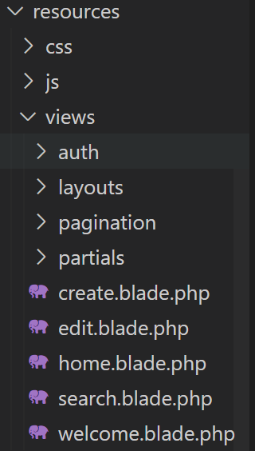
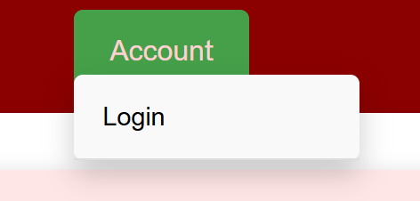
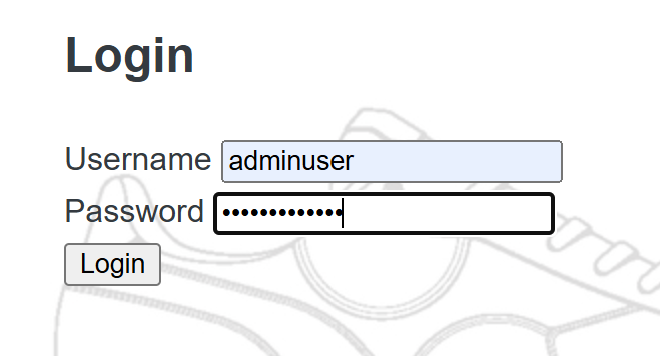
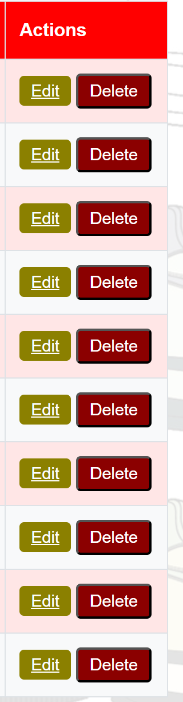
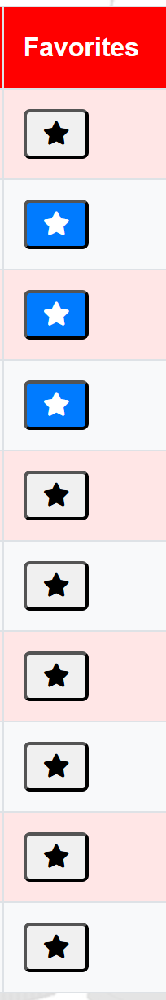
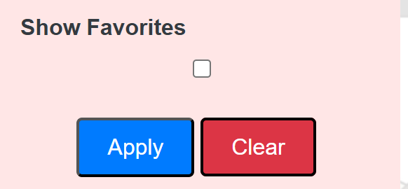
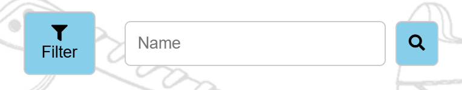
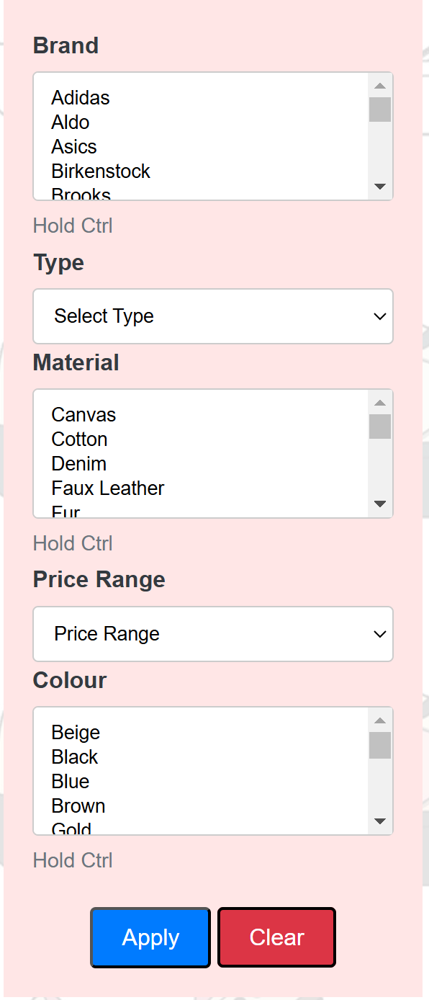
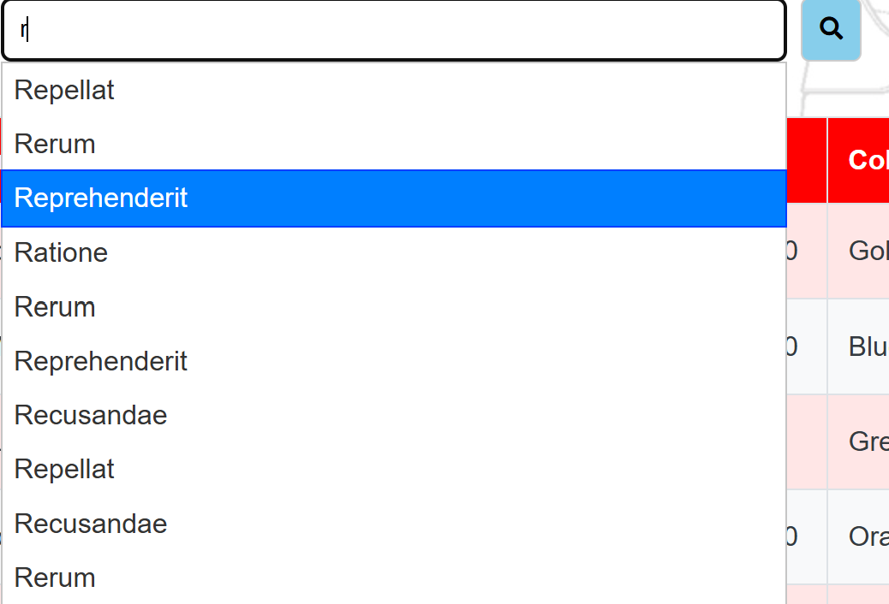

# Assignment-2 ShoeList Website

## Installation
1. 
Run ```composer install``` in Git Bash.

2. 
Ensure PHP Version 8.2 or higher is installed.

3. 
Install Node.js and npm from Node.js website.

4. 
run ```npm install``` in Git Bash.

5. 
Insatll XAMPP and run Apache and MySQL.

replace lines 252 and 253 in Apache(httpd.conf) with :
   ```DocumentRoot "/xampp/htdocs/Assignment-2-Web-development/public"```
   ```<Directory "/xampp/htdocs/Assignment-2-Web-development/public"> ```


create database called "assignment_2_web_development" in localhost xampp.


6. 
Update the .env file with your database connection details.

DB_CONNECTION=mysql
DB_HOST=127.0.0.1
DB_PORT=3306
DB_DATABASE= assignment_2_web_development
DB_USERNAME=your_username or root
DB_PASSWORD=your_password or ""

7. 
Run :
```php artisan migrate```
```php artisan db:seed```
in Git Bash.

8. 
Run ```npm run dev``` in Git Bash.


<br>
<br>
<br>

## Code Management

From first assignment the css and JavaScript files have been organised into seperate resources folders.
This makes code maintainability much easier.



<br>
<br>


#### app/resources/views/layouts/app.blade.php :
```HTML
    <main>
        @yield('content')
    </main>
```

```HTML
    <!-- Link to the external CSS file -->
    @vite(['resources/css/general_style.css']) <!-- Vite directive for CSS -->
    <!-- Stack for additional styles -->
    @stack('styles')
```
The yield directive and vite plugin allow for miantainability.

<br>
<br>

## Backend

#### Shoe table migration:
```PHP
// Create the "shoes" table with the specified columns
Schema::create('shoes', function (Blueprint $table) {
   $table->id(); // Primary key
   $table->string('name'); // Shoe name
   $table->foreignId('brand_id')->constrained('brands')->onDelete('cascade'); // Foreign key for brands
   $table->foreignId('type_id')->constrained('types')->onDelete('cascade'); // Foreign key for types
   $table->decimal('price', 12, 2); // Price
   $table->integer('stock'); // Stock quantity
   $table->date('release_date'); // Release date
});
```
As seen above The database was reworked on to allow for multiple colour and material attribbute for for a shoe. This meant normilising the databse to at least 3NF.  Colour and material have a "Pivot" table, meaning that each shoe can have multiple colours and materials. This is essential as that is the case with most shoes in the real world. The database hasn't been checked for 4NF OR 5NF meaning that in future development, problems can arise when more complex CRUD operations are added to the website. In addition, pivot table is used for user_shoe table, which stores all of the user's favourite shoes. With larger number of users and and larger favourite shoe lists indexing can become slow.


<br>


#### Colour_shoe table migration:
```PHP
public function up(): void
{
   Schema::create('colour_shoe', function (Blueprint $table) {
      $table->unsignedBigInteger('shoe_id');  // Foreign key for shoes
      $table->unsignedBigInteger('colour_id');  // Foreign key for colours
      $table->foreign('shoe_id')->references('id')->on('shoes')->onDelete('cascade');
      $table->foreign('colour_id')->references('id')->on('colours')->onDelete('cascade');
      $table->primary(['shoe_id', 'colour_id']);  // Composite primary key
   });
}
```
Foreign keys have constraint ensuring that there will be no errors in the future if certain attribute values are deleted from tables. For example colour red gets deleted, all shoes with colour red are also deleted. This is highly unlikely to happen, but it ensure integrity.


<br>


#### Seeders: 
```PHP
public function run()
    {
        // Seed the shoes first
        $shoes = Shoe::factory(500)->create();

        // Attach up to 3 random colours and 2 random materials to each shoe
        $shoes->each(function ($shoe) {
            // Attach 1 to 3 random colours from the colours table
            $colours = Colour::inRandomOrder()->take(rand(1, 3))->pluck('id');
            $shoe->colours()->attach($colours);

            // Attach 1 to 2 random materials from the materials table
            $materials = Material::inRandomOrder()->take(rand(1, 2))->pluck('id');
            $shoe->materials()->attach($materials);
        });

        // Assign 2 to 5 favorite shoes to each normal user
        $users = User::where('role', 'user')->get();
        $users->each(function ($user) use ($shoes) {
            $favoriteShoes = $shoes->random(rand(2, 5))->pluck('id');
            $user->shoes()->attach($favoriteShoes);
        });
    }
```

Seeders have been applied properly to accomodate the new database design.

<br>
<br>


## Authentication

#### app\Http\Controllers\AuthController.php:
```PHP
public function login(Request $request)
    {
        // Validate the input data (username and password)
        $request->validate([
            'username' => 'required|string',   // Username is required and should be a string
            'password' => 'required|string|min:6',  // Password is required and should have a minimum length of 6 characters
        ]);

        // Get the username and password from the request
        $credentials = $request->only('username', 'password');
        
        // Attempt to log the user in with the provided credentials
        if (Auth::attempt($credentials)) {
            // If successful, redirect to the intended page (default to home)
            return redirect()->intended('/');
        }

        // If login fails, redirect back with an error message
        return redirect()->back()->withErrors(['username' => 'Invalid credentials']);
    }
```

```PHP
public function logout(Request $request)
    {
        // Log out the user and invalidate their session
        Auth::logout();
        $request->session()->invalidate();
        $request->session()->regenerateToken();

        // Redirect the user to the login page
        return redirect()->route('login');
    }
```

Above are the methods allow for login/logout. When the login form is submited the credentials are stored in a variable. Authh::attemp() is an included class method that allows for validation user logins in Laravel. The above Authentication Controller doesn't inlcude all the Laravel's methods for handling the user accounts. For example creating a new user account. These can be implemented in the future, but for simplicity only login and logout features are included. When logging in, sessions are automatically created as Laravel handles it, and then when logging out the session is made manually invalid, to prevent unwanted user actions.

<br>


#### routes\auth.php :

```PHP
// Show the login form
Route::get('/login', [AuthController::class, 'showLoginForm'])->name('login');

// Handle login form submission
Route::post('/login', [AuthController::class, 'login'])->name('login.submit');

// Handle logout
Route::post('/logout', [AuthController::class, 'logout'])->name('logout');

```


These Routes allow for seamless redirection of users through the authentication process in the application. Laravel relies on routes to decouple logic from direct file access.

<br>





Above are the example of how the login form and Account-login button look like.


<br>
<br>

## Authorisation


### Middleware

#### app\Http\Middleware\AdminMiddleware.php :
```PHP
public function handle(Request $request, Closure $next)
    {
        // Check if the user is logged in and has the role of "admin"
        if (Auth::check()) {
            // dd(Auth::user()->role);  // Dumps the role

            if (Auth::user()->role === 'admin') {
                return $next($request); // Allow access if the user is an admin
            } else {
                return redirect()->route('home')->with('error', 'You are not authorized.');
            }
        }

        // Redirect guest users to the login page
        return redirect()->route('login')->with('error', 'Please log in to continue.');
    }
```
Say that user also has the same setup for middleware. The middlware is essential for handling authorisation for certain features of the website. in the above we do a simple check, which validates that the current logged in user is of the correct user role(no redirects happen). The middleware is always used in between actions in the website. Without this setup, authentication would have to happen in each method of the ShoeController/AuthController(mainly in the ShoeController). Therefore, the above method handle ensures a quick and easy authentication. There aren't any weaknesses.

<br>

### Routes

#### Middleware routes:
```PHP
// Routes accessible to authenticated users with 'user' role
Route::middleware(['user'])->group(function () {
    Route::post('/favorites/add/{shoe}', [ShoeController::class, 'addToFavorites'])->name('favorites.add'); // Add shoe to favorites
    Route::post('/remove-from-favourites/{shoe}', [ShoeController::class, 'removeFromFavourites'])->name('favorites.remove'); // Remove shoe from favorites
});

// Routes accessible to authenticated users with 'admin' role
Route::middleware(['admin'])->group(function () {
    Route::get('/shoes/{id}/edit', [ShoeController::class, 'edit'])->name('edit'); // Edit shoe details
    Route::put('/shoes/{id}', [ShoeController::class, 'update'])->name('update'); // Update shoe details
    Route::delete('/shoes/{id}', [ShoeController::class, 'destroy'])->name('delete'); // Delete a shoe
    Route::get('/create', [ShoeController::class, 'create'])->name('create'); // Create a new shoe form
    Route::post('/store', [ShoeController::class, 'store'])->name('store'); // Store new shoe in the database
});

```
The above middleware Routes have addditional feature compared to a normal Route. Multiple middlewares can be applied to groups of Routes. In the above example admin which is short alias for AdminMiddleware. This means that the user must be logged in as an Admin account. Middleware auth can be used in some cases if you just want any type of logged in user to have access. Grouping middlewaare Routes esnures easy solution for authorising users through web pages. This feature has no weaknesses and is used for example in the search page for edit and delete button access.

<br>

##### bootstrap\app.php :
```PHP
return Application::configure(basePath: dirname(__DIR__))
    ->withRouting(
        web: __DIR__.'/../routes/web.php',
        commands: __DIR__.'/../routes/console.php',
        health: '/up',
    )
    ->withMiddleware(function (Middleware $middleware) {
        // Register 'admin' middleware alias
        $middleware->alias([
            'admin' => AdminMiddleware::class,
            'user' => UserMiddleware::class,
        ]);
    })
    ->withExceptions(function (Exceptions $exceptions) {
        //
    })->create();
```

Laravel has a convention where all custom middlewares must be declared above. 

<br>
<br>

### Create
#### resources\views\create.blade.php :

```PHP
<!-- Only show 'Create' link if the user is an admin -->
@if(Auth::check() && Auth::user()->role === 'admin')
   <a href="{{ route('create') }}">Create</a>
@endif
```
The above code ensures that only admin users have the view and access to the create page in the header. The reason why the create is only visible to admins, is beacause ensures an easy experience for other non-admin users. This feature ensure no mistakes caused by other users. This feature has been implemented well.

<br>

#### routes/shoe/php
```PHP
// Routes accessible to authenticated users with 'admin' role
Route::middleware(['admin'])->group(function () {
   Route::get('/create', [ShoeController::class, 'create'])->name('create'); // Create a new shoe form
   Route::post('/store', [ShoeController::class, 'store'])->name('store'); // Store new shoe in the database
});
```

The above routes are exclusive to only admins.

<br>
<br>


<br>

<br>


#### Create header visible when logged in as the admin

<br>
<br>

### Edit/Delete buttons
#### resources\views\partials\shoe_table.blade.php :

Admins have also access to updating and deleting shoes from the database.

```PHP
<!-- Admin actions: Edit and Delete buttons -->
@if(Auth::check() && Auth::user()->role === 'admin')
      <td>
         <!-- Edit button that links to the edit page for the shoe -->
         <a href="{{ route('edit', $shoe->id) }}" class="btn btn-warning">Edit</a>
         
         <!-- Form to delete the shoe -->
         <form action="{{ route('delete', $shoe->id) }}" method="POST" style="display:inline-block;">
            @csrf <!-- CSRF token for security -->
            @method('DELETE') <!-- HTTP DELETE method -->
            <button type="submit" class="btn btn-danger">Delete</button>
         </form>
      </td>
@endif
```

Once again the table column with the buttons are only visible to admin users. This guarantees that a normal user will have no knowledge of database front-end management CRUD interaction.

<br>

```PHP
Route::middleware(['admin'])->group(function () {
    Route::get('/shoes/{id}/edit', [ShoeController::class, 'edit'])->name('edit'); // Edit shoe details
    Route::put('/shoes/{id}', [ShoeController::class, 'update'])->name('update'); // Update shoe details
    Route::delete('/shoes/{id}', [ShoeController::class, 'destroy'])->name('delete'); // Delete a shoe
});
```

The above middleware route further protects the database from any unwanted users.

<br>



#### Action buttons in the table column

<br>
<br>

### Favourite button
#### resources\views\partials\shoe_table.blade.php :

The normal user, who is logged in, has the ability to add shoes to their favourite's list.


```PHP
<!-- User actions: Add or remove from favorites -->
@if(Auth::check() && Auth::user()->role === 'user')
      <td>
         <!-- Check if the shoe is already in the user's favorites -->
         @php
            $isFavourite = Auth::user()->shoes->contains($shoe->id);
         @endphp

         <!-- If the shoe is in the user's favorites, show the remove button -->
         @if($isFavourite)
            <form action="{{ route('favorites.remove', $shoe->id) }}" method="POST">
                  @csrf <!-- CSRF token for security -->
                  <button type="submit" class="btn btn-primary">
                     <i class="fas fa-star"></i> <!-- Icon for a filled star (favorite) -->
                  </button>
            </form>
         <!-- If the shoe is not in the user's favorites, show the add button -->
         @else
            <form action="{{ route('favorites.add', $shoe->id) }}" method="POST">
                  @csrf <!-- CSRF token for security -->
                  <button type="submit" class="btn btn-light">
                     <i class="fas fa-star"></i> <!-- Icon for an empty star (add to favorite) -->
                  </button>
            </form>
         @endif
      </td>
@endif
```
Repeated again, only user accounts can see the button.


```PHP
// Routes accessible to authenticated users with 'user' role
Route::middleware(['auth', 'user'])->group(function () {
    Route::post('/favorites/add/{shoe}', [ShoeController::class, 'addToFavorites'])->name('favorites.add'); // Add shoe to favorites
    Route::post('/remove-from-favourites/{shoe}', [ShoeController::class, 'removeFromFavourites'])->name('favorites.remove'); // Remove shoe from favorites
});
```

#### Favourite button in table as a column

<br>
<br>

### Favourite Shoe List Filter
#### resources\views\partials\filter_form.blade.php :

The user can view their favourite list through the filter option.

```PHP
<!-- Only show the "Favorites" filter for logged-in normal users -->
@if(Auth::check() && Auth::user()->role === 'user')
   <div>
         <label for="favorites">Show Favorites</label> <!-- Label for the favorites checkbox -->
            <input type="checkbox" name="favorites" id="favorites" value="1" {{ request('favorites') == '1' ? 'checked' : '' }}> <!-- Checkbox to show only favorites -->
   </div>
@endif
```
Only visible to user account type.


### Filter By Favourites Option 
<br>
<br>

## Resizing
### resources\css\filter_form_style.css:


```PHP
/* Large Screen Styles */
@media (min-width: 1024px) {
    /* Hide filter button on large screens */
    .filter-btn {
        display: none;
    }
```
To allow phone or small screen users, the filter tablel will collapse and only become visible through the fillter button. This is to ensure the user has an easy time navigating the page. Without this feature the user would have to endlessly scroll through the page just to perform an action.

<br>
<br>



### Small screen filter

<br>
<br>




### Large screen filter

<br>
<br>

## Auto Search

### resources\js\autocomplete.js:

```JavaScript
$(function () {
    $("#name").autocomplete({
        source: function (request, response) {
            $.ajax({
                url: "/search/autocomplete",
                data: { term: request.term },
                success: function (data) {
                    response(data);
                },
                error: function (jqXHR, textStatus, errorThrown) {
                    console.error("Error fetching autocomplete data:", errorThrown);
                },
            });
        },
        minLength: 1, // Minimum characters before suggestions appear
    });
});
```
The jQuery code is more concise and easier to write compared to vanilla JavaScript due to its simplified syntax for tasks like event handling, DOM manipulation, and AJAX requests. If written in JavaScript the code would be much longer. The only issue is that jQuery is around 80-100 KB in library size meaning slower performance. However, for this simple website the affects are minimal.

<br>



#### The autocomplete search bar.